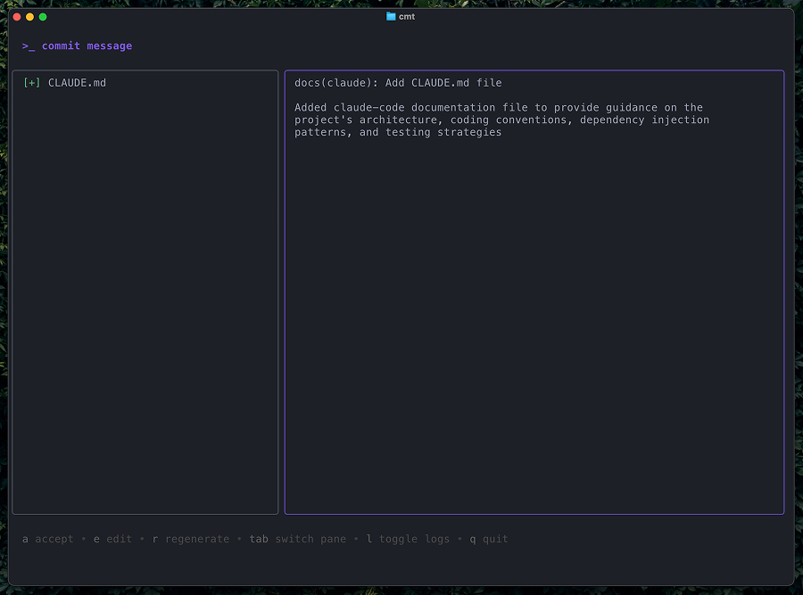

# cmt

**cmt** is a command-line utility that generates [Conventional Commit](https://www.conventionalcommits.org/) messages using OpenAI's GPT models based on staged Git changes.

It automates the process of writing clear and structured commit messages, enhancing your Git workflow and ensuring consistency across projects.



## Features

- **Commit Message Generation**: Generates commit messages following the [Conventional Commits](https://www.conventionalcommits.org/) specification using GPT.
- **Changelog Generation**: Generates changelogs based on your commit history and outputs to console.
- **Interactive TUI**: Modern terminal user interface with split-panel view showing file tree and commit message for review and editing.
- **Editor**: Built-in editor for commit message editing.
- **Custom Prefixes**: Supports adding custom prefixes to commit messages (e.g., task IDs, issue numbers).
- **Logging**: Built-in TUI log viewer with ring buffer for debugging and troubleshooting.

## Prerequisites

Before installing and using **cmt**, ensure you have the following:

- **Go**: Version 1.24 or higher is recommended.
- **Git**: Ensure Git is installed and initialized in your project.
- **OpenAI API Key**: Obtain an API key from [OpenAI](https://platform.openai.com/account/api-keys) to use GPT models.

## Installation

1. **Clone the Repository**

   ```sh
   git clone https://github.com/tab/cmt.git
   ```

2. **Navigate to the Project Directory**

   ```sh
   cd cmt
   ```

3. **Set Up Environment Variables**


   ```sh
   export OPENAI_API_KEY=your-api-key-here
   ```

_For permanent setup, add the above line to your shell profile (`~/.bashrc`, `~/.zshrc`, etc.)._

4. **Build the Binary**

   ```sh
   go build -o cmd/cmt cmd/main.go
    ```

5. **Make the Binary Executable**

   ```sh
   chmod +x cmd/cmt
   ```

6. **Move the Binary to Your PATH**

   ```sh
   sudo ln -s $(pwd)/cmd/cmt /usr/local/bin/cmt
   ```

7. **Verify Installation**

   ```sh
    cmt --version
    ```

## Configuration

Create a `cmt.yaml` file in the current directory:

```yaml
api:
  retry_count: 3  # Number of retry attempts for API requests
  timeout: 60s    # Timeout duration for API requests

model:
  name: gpt-4.1-nano # OpenAI model to use
  max_tokens: 500    # Maximum tokens for the model response
  temperature: 0.7   # Controls randomness of the model output

logging:
  level: info        # Logging level (debug, info, warn, error)
```

## Usage

Navigate to your git repository and stage the changes you want to commit:

```sh
git add .
```

Run the `cmt` command to generate a commit message:

```sh
cmt
```

Review the generated commit message in an interactive split-panel TUI:

- **Left Panel**: File tree showing staged files (scrollable)
- **Right Panel**: Generated commit message (scrollable)
- **Focus Indicator**: The focused pane has a blue border

**Key Bindings:**
- `Tab` - Switch focus between panes
- `j`/`k` or `↑`/`↓` - Scroll focused pane
- `a` - Accept and commit
- `e` - Edit message (opens vim-style modal editor)
- `r` - Refresh (regenerate from GPT)
- `l` - Toggle application logs
- `q` or `Ctrl+C` - Quit without committing

If you accept (`a`), the changes will be committed:

```sh
🚀 Changes committed:
[feature/jwt 29ca12d] feat(core): Add user authentication
 2 files changed, 106 insertions(+), 68 deletions(-)
```

### Custom Prefix

Add a custom prefix to your commit message (e.g., issue tracker ID):

```sh
cmt --prefix "JIRA-123"
# or
cmt prefix "JIRA-123"
# or
cmt -p "JIRA-123"
```

The prefix will be prepended to the generated commit message:

```
JIRA-123 feat(core): Add user authentication
```

### Changelog Generation

Generate a changelog from your commit history and output directly to console:

```sh
cmt changelog                 # From first commit to HEAD
cmt changelog v1.0.0..v1.1.0  # Between version tags
cmt changelog SHA1..SHA2      # Between specific commits
cmt changelog SHA..HEAD       # From commit to HEAD
```

The changelog is generated using GPT and output in Markdown format:

Example output:

```markdown
# CHANGELOG

## [1.1.0]

### Features

- **feat(jwt):** Add user authentication
- **feat(api):** Implement rate limiting for API endpoints

### Bug Fixes

- **fix(auth):** Resolve token expiration issue
```

### Log Viewer

The TUI includes a built-in log viewer for debugging and troubleshooting.

**Accessing Logs:**

Press `l` repeatedly to cycle through views:
1. **Commit Message** (default) - Shows the generated commit message
2. **Diff View** - Shows the staged changes (git diff)
3. **Application Logs** - Shows structured application logs with timestamps and context

**Log Levels:**

Set the log level to control verbosity:

```sh
# config file (cmt.yaml)
logging:
  level: debug
```

## FAQ

**Q:** How do I obtain an OpenAI API key?

**A:** You can obtain an API key by signing up at [OpenAI's website](https://platform.openai.com/account/api-keys). After signing in, navigate to the API keys section to generate a new key.

---

**Q:** How can I ensure that private information isn't shared with OpenAI?

**A:** Here are some best practices to prevent sharing private information with OpenAI:

1. **Review Staged Changes**: Before running the `cmt` command, carefully review the changes you have staged using `git diff --staged`. Ensure that no sensitive information (like passwords, API keys, or personal data) is included.
2. **Exclude Sensitive Files**: Use `.gitignore` to exclude files that contain sensitive information from being tracked and staged. For example:

   ```gitignore
   .env
   secrets/
   ```

## License

Distributed under the MIT License. See `LICENSE` for more information.

## Acknowledgements

- [OpenAI](https://openai.com/) for providing the GPT models.
- [Conventional Commits](https://www.conventionalcommits.org/) for the commit message specification.
